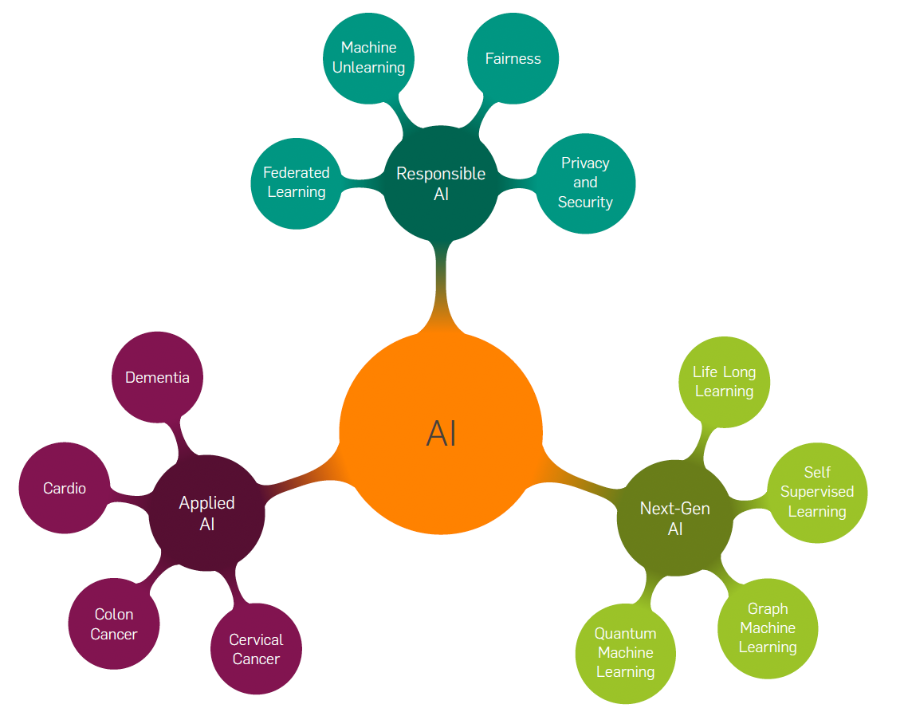

Currently, I am working on the following topics with a focus on healthcare, IIoT, and fusion energy. 

### 1. **Responsible AI**
Artificial intelligence (AI) is rapidly transforming industries and daily life, but it also raises serious concerns regarding data privacy, security, fairness, ethics, and copyright compliance. Addressing these challenges will help to foster trust and acceptance of AI technologies across various fields.

**(Personalized) Federated Learning**: Federated learning (FL) is a distributed machine learning paradigm that allows a network of devices (e.g., hospitals, smartphones, media streamers, and Internet of things nodes) to collaboratively learn a global shared AI model without explicitly sharing their local raw data with the server or other devices (i.e., strictly adhering to data regulations like GDPR). Unlike traditional FL, which learns a single AI model, our focus is on developing personalized AI models tailored to specific subgroups of the population while maintaining GDPR compliance.

**Security and Privacy in Federated Learning**: Enhancing the safety and confidentiality of distributed learning systems.
**Machine Unlearning**: Removing/erasing the knowledge of specific data samples from already trained AI models to comply with data regulations.
**Fairness-Aware AI**: Promoting unbiased and equitable decision-making in AI systems.

### 2. **Advanced Learning Techniques**
- **Self-Supervised Learning**: Leveraging abundant unlabeled data in the presence of very limited labeled data.
- **Continual Learning**: Enabling AI models to adapt and learn continuously from new data.
- **Meta Learning**: Developing AI models that can adapt swiftly to new tasks.

### 3. **AI in Healthcare and Industrial Applications**
- **AI for Healthcare**: Applying advanced AI techniques to improve outcomes in healthcare, including diagnostics and personalized treatment.
- **AI for IIoT (Industrial Internet of Things)**: Enhancing automation and decision-making in industrial settings through AI models that process large-scale sensor data.

### 4. **Physics-Informed AI and Advanced Models**
- **Physics-Informed Neural Networks**: Integrating physical laws into neural networks for more accurate predictions in complex systems like energy or medical simulations.
- **AI for Fusion Energy**: Leveraging AI models, particularly, PINNs to forecast fuel-ion ratio. 
